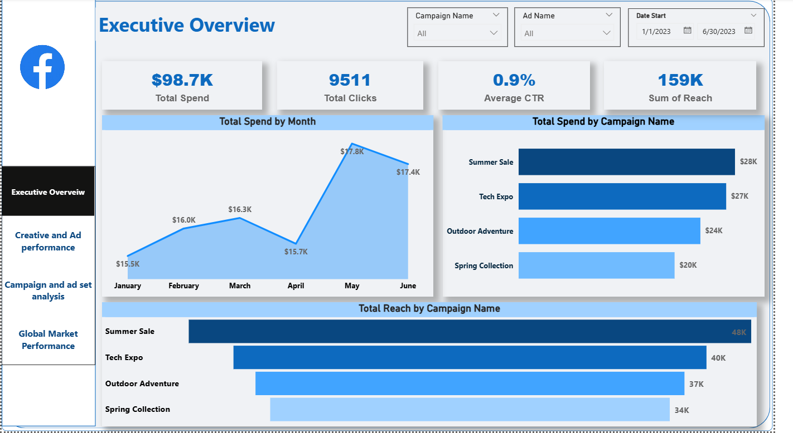

# From Clicks to Clarity: Decoding $98.7K in Facebook Ad Spend

## Project Overview
Digital advertising at scale creates a paradox: the more you spend, the harder it becomes to know whether each dollar is working. Managing a budget across multiple international markets, ad sets, and creative variations easily introduces performance visibility issues.

This project analyzes **$98,700 in Facebook advertising spend** deployed between January and June 2023. Spanning 181 detailed ad records across four major campaigns, three ad sets, and eleven global markets, this analysis replaces intuition with evidence. The resulting four-page interactive Power BI dashboard isolates major spend inefficiencies, uncovers high-performing audience segments, and provides data-driven support for future budget allocations.

## Tools Used
* **Power BI Desktop** (Data Ingestion, Modeling, and Dashboard Architecture)
* **DAX - Data Analysis Expressions** (Advanced custom metrics and KPI calculation)
* **Power Query** (Data cleaning, type standardization, and transformation)

## Dataset
The project utilizes a dataset of 181 granular marketing performance records spanning from January 2, 2023, through July 27, 2023. 
* **Attributes:** Features include chronological data (`Date Start`, `Date Stop`), identifiers (`Ad ID`, `Ad Name`), logical groupings (`Campaign Name`, `Ad Set Name`), and performance metrics (`Amount Spend`, `Clicks`, `Impressions`, `Reach`, `CPM`, `CTR`).

## Key Questions Answered
* **Budget Allocation:** Is the $98.7K in total spend being directed toward campaigns that generate optimal engagement, or is it being underutilized?
* **Market Efficiency:** Are high-CPM international markets (such as Argentina and the US) delivering proportional click value, or are they draining financial resources?
* **Creative Accountability:** Which specific ad creatives are driving active user engagement, and which ones are suffering from creative fatigue?
* **Temporal Trends:** Did ad spend and reach efficiency improve, decline, or plateau across the six-month operational window?

## Process

### 1. Data Cleaning & Transformation (Power Query)
* Imported the raw marketing CSV file into Power BI Desktop.
* Standardized date fields into explicit Date data types.
* Verified all financial and percentage columns (`Spend`, `CPM`, `CTR`) as Decimal Numbers, converting raw ratios into readable percentage formats.
* Screened for and removed empty fields or malformed rows to maintain structural data integrity.

### 2. DAX Measure Development
To support dynamic cross-filtering and high-level KPI cards, a suite of custom DAX measures was developed:
* **Total Spend** = `SUM(AdsData[Amount Spend])`
* **Total Clicks** = `SUM(AdsData[Clicks])`
* **Sum of Reach** = `SUM(AdsData[Reach])`
* **Average CTR** = `AVERAGE(AdsData[CTR])`
* **Average CPM** = `AVERAGE(AdsData[CPM])`
* **CPC (Cost Per Click)** = `[Total Spend] / [Total Clicks]`

### 3. Dashboard Architecture & Visual Design
The interactive report is structured across four dedicated analytical perspectives:
* **Executive Overview:** Top-line financial KPIs, a temporal trend line for monthly spend tracking, and a ranked campaign budget breakdown for executive sign-off.
* **Creative & Ad Performance:** Dual horizontal bar charts mapping ad creative success using conditional color-coding (Green for top performers, Red for underperformers) alongside a detailed evaluation matrix.
* **Campaign & Ad Set Analysis:** Features a dual-axis line/bar combo chart comparing CPC vs. CTR directly, exposing immediate efficiency or friction points across campaigns.
* **Global Market Performance:** A geographic overview using a Bing-powered map visual combined with area charts to juxtapose high-cost CPM zones against high-volume click regions.

## Insights & Recommendations

### Key Insights
* **The Cost-to-Engagement Disconnect:** The *Outdoor Adventure* campaign exhibited severe friction, generating the highest average Cost Per Click (**$11.3**) alongside the lowest overall CTR (**0.8%**). Conversely, *Summer Sale* proved highly efficient, yielding a **1.1% CTR** at a baseline CPC of only **$9.1**.
* **Creative Polarization:** Creative performance is heavily skewed. The **"Mobile app downloads"** asset led the entire portfolio with a **1.3% CTR**, while **"Landing traffic"** lagged significantly at **0.6%**—representing a 2x variance in consumer engagement on the exact same ad budget.
* **Geographic Variance:** Reaching target audiences reveals stark regional cost differences. Argentina led with an expensive **$162.5 CPM**, whereas Canada offered a highly cost-effective **$77.6 CPM** (a 52% cost savings). Crucially, Indonesia and South Africa demonstrated high engagement spikes (~2,000 clicks each) despite holding modest, mid-tier CPMs.
* **Temporal Anomalies:** Monthly budget tracking showed a notable decline in April (**$15.7K**) sandwiched between consistent growth in March ($16.3K) and a seasonal peak in May ($17.8K), signaling a potential campaign gap.

### Recommendations
* **Optimize Campaign Weights:** Shift 15–20% of marketing budgets out of underperforming *Outdoor Adventure* structures and reallocate them into the highly efficient *Summer Sale* and *Spring Collection* matrices.
* **Execute Creative Scaling:** Instigate an isolated A/B test pitting the portfolio leader *"Mobile app downloads"* against the highly scalable *"Budget 2x"* asset at double the budget over a 14-day trial to check for downstream conversion retention.
* **Restructure Geographic Target Budgets:** Cap budget scales in high-cost, low-yield environments like Argentina. Increase spending allocations by 25% across high-engagement, cost-efficient nodes like Canada and Indonesia for Q3.
* **Instate Operational Alerts:** Conduct an audit into the April spend decline. Implement a real-time budget pacing alert visual within Power BI using custom conditional formatting to instantly flag monthly under-delivery.
* **Retire Inefficient Assets:** Immediately pause the *"A/B test 3"* creative asset. It carries extreme operational overhead—reaching spikes of **$432 CPM** while generating fewer than 32 total clicks across multiple ad sets.

## Dashboard Preview

## Files Included
* **`data/`**: Anonymized raw Facebook ad export data files.
* **`report/`**: The compiled Power BI Desktop File (`.pbix`) containing the data model, DAX measures, and visual sheets.
